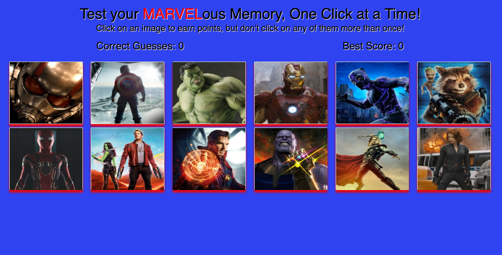

# Marvel Memory Game/React App

### **Description:**
This is a Marvel character themed game that tests your memory. 12 images of marvel characters are displayed in a flex grid. When an image is clicked, all images are then immediately and randomly shuffled. The objective is to successfully click on all 12 Marvel characters without clicking on the same character twice, which results in a win! If an image is clicked twice, the player loses and a new round starts. Player wins and losses are tracked and displayed. This application utilizes the power of React JavaScript library. This allows the state of the components to be updated quickly and dynamically during gameplay. 
 
_____

### **Instructions for Playing**
* This game is deployed on Heroku
* Paste the following link into the browser: 
* https://tranquil-stream-41866.herokuapp.com
* Side note: This game sometimes takes a little time to load properly
* Click on any character to start the game, be sure to remember which character/s you have already selected.
* Player Wins: When all characters have been selected only once
* Player Loses: If any character is selected more than once
 
_____

### **Demo Screenshots**
##### Marvel Memory Game
* Here's what the game looks like!

 
_________

### **Core Technologies Used**
* HTML5
* CSS
* JavaScript
* React
* Node Package Manager
* Heroku
 
_____

### **Built With**
* Visual Studio Code

